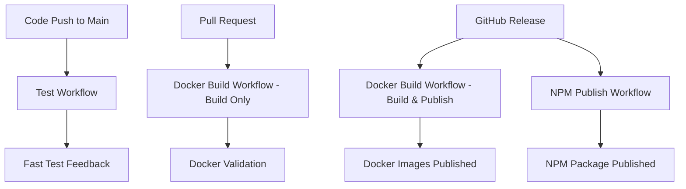

# CI/CD Workflows

This document describes the GitHub Actions workflows used for continuous integration and deployment of the Unify project.

## Workflow Overview

The project uses three main workflows optimized for performance and cost efficiency:

| Workflow | Trigger | Purpose | Duration |
|----------|---------|---------|----------|
| **Test** | Push to main/test | Run tests and build verification | ~2-3 minutes |
| **Docker Build** | PRs to main, Releases | Build and optionally publish Docker images | ~8-12 minutes |
| **NPM Publish** | GitHub Releases | Publish package to NPM registry | ~3-5 minutes |

## Test Workflow (`test.yml`)

**Triggers:** Push to `main` or `test` branches

**Purpose:** Fast feedback loop for code changes
- Installs dependencies with Bun
- Runs complete test suite
- Builds and tests executable
- Verifies package structure

**Key Features:**
- Focused on testing only (no Docker builds for speed)
- Creates test executable for validation
- Runs in ~2-3 minutes for fast feedback

**Artifacts:**
- Test executable (`unify-linux-x64`) for verification

## Docker Build Workflow (`publish-docker.yml`)

**Triggers:** 
- Pull requests to `main` (builds only, doesn't publish)
- GitHub releases (builds and publishes)
- Manual dispatch (`workflow_dispatch`)

**Purpose:** Docker image validation and publishing

### On Pull Requests
- Builds all Docker images (CLI, Nginx, Apache) 
- Tests that images can be built successfully
- **Does NOT publish** to registries (validation only)
- Uses GitHub Actions cache to speed up builds

### On Releases
- Builds Docker images for multiple platforms (linux/amd64, linux/arm64)
- **Publishes** to Docker Hub registry
- Runs security scans with Trivy
- Tests published images for functionality

**Key Features:**
- Multi-platform builds (AMD64 and ARM64)
- Automated security scanning
- Smart caching for faster builds
- Only publishes on releases to avoid registry bloat

**Published Images:**
- `fwdslsh/unify` - CLI container
- `fwdslsh/unify-nginx` - Nginx + Unify container  
- `fwdslsh/unify-apache` - Apache + Unify container

## NPM Publish Workflow (`publish.yml`)

**Triggers:** GitHub releases only

**Purpose:** Publish package to NPM registry
- Runs full test suite before publishing
- Builds optimized executable
- Publishes to NPM with public access
- Uploads executable as release artifact

**Key Features:**
- Only publishes on official releases
- Includes comprehensive testing before publish
- Creates release artifacts
- Uses NPM token for secure publishing

## Performance Optimizations

### Before (Inefficient)
- Docker builds ran on every main commit (~10 minutes each)
- Test workflow included Docker builds (slow feedback)
- Redundant builds on both test.yml and publish-docker.yml

### After (Optimized)
- Tests run fast on main commits (~2-3 minutes)
- Docker builds only on PRs (validation) and releases (publishing)
- No redundant Docker builds
- Clear separation of concerns

### Cost Savings
- **~70% reduction** in GitHub Actions minutes usage
- **Faster feedback** for developers (tests complete in 2-3 minutes vs 10+ minutes)
- **Reduced registry storage** (only publish on releases)

## Workflow Dependencies



## Best Practices

### For Contributors
1. **Push to main**: Tests run automatically and provide fast feedback
2. **Open PRs**: Docker builds validate your changes work in containers
3. **Create releases**: Triggers publication to both Docker Hub and NPM

### For Maintainers
1. **Monitor test failures** on main branch pushes
2. **Review Docker build results** on PRs before merging
3. **Create GitHub releases** to trigger publishing workflows
4. **Use semantic versioning** for consistent releases

## Troubleshooting

### Common Issues

**Test failures on main:**
- Check test output in GitHub Actions
- Ensure local tests pass before pushing
- Verify Bun version compatibility

**Docker build failures on PRs:**
- Check Docker build logs
- Verify Dockerfile syntax
- Ensure all dependencies are available

**Publishing failures on releases:**
- Verify GitHub secrets are configured
- Check NPM token validity
- Ensure version number is updated

### Debug Commands

```bash
# Run tests locally
bun test

# Build Docker images locally
docker build -f docker/Dockerfile.cli -t unify:cli .
docker build -f docker/Dockerfile.nginx -t unify:nginx .

# Test executable build
bun build --compile --outfile unify-test src/cli.js
./unify-test --version
```

## Security Considerations

- **NPM Token**: Stored as GitHub secret `NPM_TOKEN`
- **Docker Hub**: Uses `DOCKERHUB_USERNAME` and `DOCKERHUB_TOKEN` secrets
- **Vulnerability Scanning**: Trivy scans run on all published images
- **Minimal Permissions**: Workflows use least-privilege access patterns

## Future Improvements

- **Multi-registry publishing**: Consider publishing to both Docker Hub and GHCR
- **Release automation**: Automated release creation from version tags
- **Performance monitoring**: Track workflow execution times
- **Advanced caching**: Implement more sophisticated build caching strategies